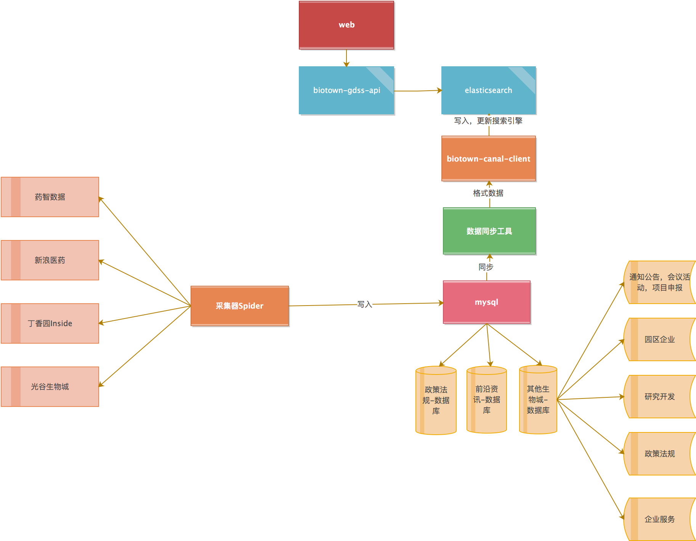
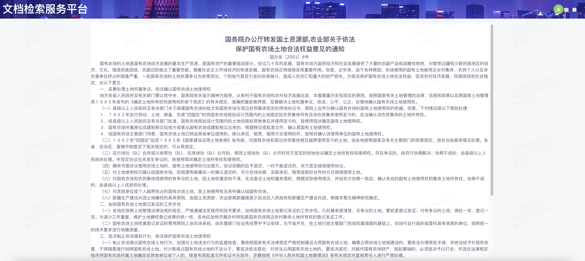

## 文档检索服务平台

文档检索服务平台是基于Elasticsearch的全文检索，包含数据采集、数据清洗、数据转换、数据检索等模块。

项目地址：[Github](https://github.com/silianpan/gdss-web)、[国内Gitee](https://gitee.com/twofloor/gdss-web)

演示地址：http://silianpan.cn/gdss/

以下是演示角色和账号（密码同账号）：

* 测试用户：test
* 超级管理员：admin

**欢迎沟通交流，作者(wx:twofloor1993,qq:2480621579)**

### 系统架构

### 部分截图

* 登录

  

* 全文检索

  

* 文章详情

  

